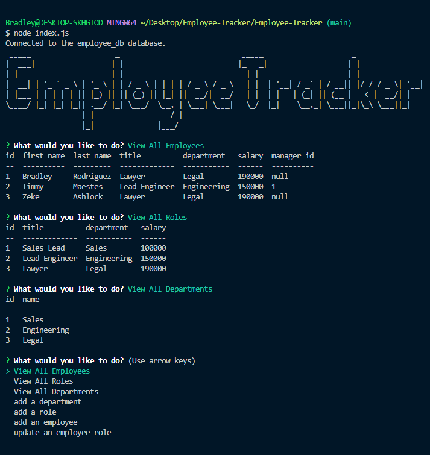

# Employee-Tracker

[](https://opensource.org/licenses/MIT)

## Description

This program allows you to look at different databases and add and edit them. You can look at employees, roles, and departments. Along with being able to add departments, roles, employees, and update employee roles.

## Table of Contents (Optional)

- [Installation](#installation)
- [Usage](#usage)
- [Questions](#questions)

## Installation

To install necessary depenencies, run the follwing command:

```md
npm i
```

## Usage

To use, run node index.js and follow the prompts on screen.
https://drive.google.com/file/d/1jvFFBKAzwU39Mbfd6CIcP-kKAIoFgFRH/view



## How to Contribute

Feel free to fork and contribute however you like.

## Tests

npm test

## Questions?

Reach out to me!

-GitHub: [HeyItsBradley](https://github.com/HeyItsBradley)

-Email: bradleyrodriguez77@gmail.com
